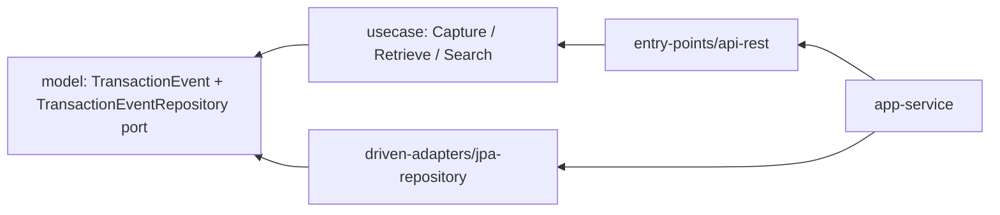
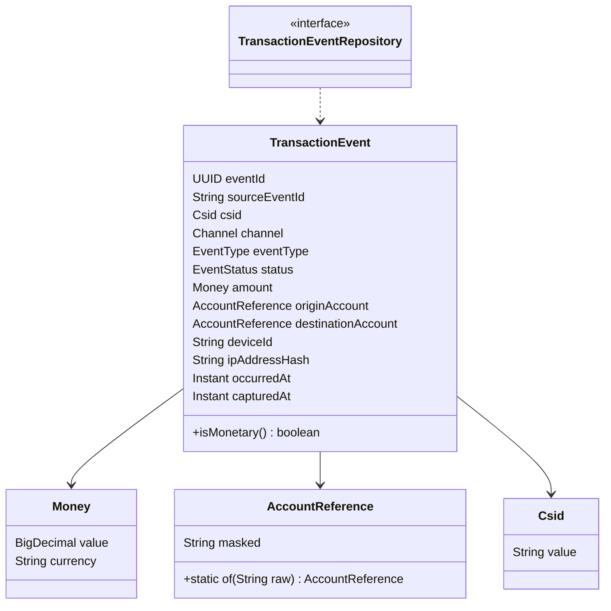

# 01 · transaction-log-service — Customer Event History (Junior 1/5)

---

## 1. Project Overview

| Attribute | Value |
|-----------|-------|
| Level | Junior (1 of 5) |
| BIAN Service Domain | Customer Event History |
| BIAN Control Record | Customer Event Log (Track pattern) |
| Behavior Qualifier modeled | Transaction Event entry |
| Technical microservice | `transaction-log-service` |
| Base package | `co.com.portfolio.txlog` |
| Scaffold type | `imperative` |
| Stack | Java 21 · Spring Boot (version pinned by scaffold) · Spring MVC · Spring Data JPA · PostgreSQL · Flyway · Lombok |
| Error prefix | `TXL` |

**Elevator pitch.** Every channel (app, web, branch, ATM, open API) reports what a customer did. This service is the bank's immutable registry of those transaction events: it captures them exactly once, never modifies them, masks sensitive data at the boundary, and lets fraud, audit and customer-service teams query a customer's history by CSID and time range.

---

## 2. Business Context and Functional Scope

**Context.** Fraud analysts, auditors and regulators need a trustworthy answer to "what did this customer do, from where, and when?". Channels retry on timeouts, so the same event can arrive twice; the log must not duplicate it. Once written, an entry is evidence and must never change.

**In scope**

| ID | Requirement |
|----|-------------|
| FR-01 | Capture a transaction event reported by a channel. |
| FR-02 | Capture is idempotent on `sourceEventId`: a replay returns the original entry with `200`. |
| FR-03 | Retrieve a single event by `eventId`. |
| FR-04 | Search events by `csid` (mandatory), date range (mandatory, max 90 days), optional `eventType` and `channel`, paginated and sorted by `occurredAt` descending. |
| FR-05 | Account references are stored and returned masked (only last 4 digits visible). |
| FR-06 | Entries are append-only: no update or delete operation exists at API or database-grant level. |

**Out of scope:** event streaming to Kafka (added conceptually in project 11), retention purge jobs, analytics.

**Business rules**

| Rule | Description |
|------|-------------|
| BR-01 | Monetary event types (`TRANSFER`, `PAYMENT`, `WITHDRAWAL`) require `amount > 0` with scale ≤ 2. |
| BR-02 | Non-monetary event types (`LOGIN`, `PROFILE_CHANGE`) must not carry an amount. |
| BR-03 | `occurredAt` cannot be more than 5 minutes in the future relative to the server clock (clock-skew tolerance). |
| BR-04 | `capturedAt` is always assigned by the service, never by the client. |
| BR-05 | Search range `to - from` must be ≤ 90 days and `from < to`. |
| BR-06 | Page size between 1 and 100; default 20. |

---

## 3. Architecture and Learning Objectives

**Learning objectives**
1. Generate an imperative scaffold project and understand every module it creates.
2. Keep `domain/model` and `domain/usecase` free of Spring, JPA and Jackson annotations.
3. Design a gateway (port) whose signature uses **domain** pagination types, not `org.springframework.data.domain.Page`.
4. Map three models deliberately: HTTP DTO ↔ domain entity ↔ JPA entity.
5. Implement idempotency with a unique constraint plus a lookup-before-insert.
6. Apply masking inside a value object so unmasked data can never leak past the domain.

**Dependency direction**



`TransactionEventRepository` is declared in `model` and implemented in `jpa-repository`. The use case only knows the interface; `app-service` injects the JPA adapter at runtime.

**Scaffold commands**

```shell
gradle ca --package=co.com.portfolio.txlog --type=imperative --name=TransactionLogService --lombok=true --java-version=21
gradle gm  --name=TransactionEvent
gradle guc --name=CaptureTransactionEvent
gradle guc --name=RetrieveTransactionEvent
gradle guc --name=SearchTransactionEvents
gradle gep --type=restmvc --server=tomcat
gradle gda --type=jpa
```

---

## 4. Detailed Domain Model



**Enums**

| Enum | Values |
|------|--------|
| `Channel` | `APP`, `WEB`, `BRANCH`, `ATM`, `OPEN_API` |
| `EventType` | `TRANSFER`, `PAYMENT`, `WITHDRAWAL`, `LOGIN`, `PROFILE_CHANGE` |
| `EventStatus` | `APPROVED`, `REJECTED`, `PENDING` |

**Value object rules**

| Value object | Invariant |
|--------------|-----------|
| `Csid` | Matches `^CS[A-Z2-7]{16}$` (format produced by project 02). |
| `Money` | `value` non-null, `> 0`, scale ≤ 2; `currency` ∈ {`COP`, `USD`}. |
| `AccountReference` | Built from a raw account of 8–20 digits; stores only `"******" + last4`. The raw value is never kept in a field. |

**Domain types for pagination (in `model`)**

| Type | Fields |
|------|--------|
| `PageQuery` | `int page`, `int size` |
| `PageResult<T>` | `List<T> items`, `int page`, `int size`, `long totalElements`, `int totalPages` |
| `TransactionEventCriteria` | `Csid csid`, `Instant from`, `Instant to`, `EventType eventType` (nullable), `Channel channel` (nullable) |

---

## 5. Detailed Class and Package Specification

```text
domain/model/src/main/java/co/com/portfolio/txlog/model/
├── transactionevent/
│   ├── TransactionEvent.java
│   ├── TransactionEventCriteria.java
│   ├── Channel.java · EventType.java · EventStatus.java
│   └── gateways/TransactionEventRepository.java
├── shared/
│   ├── Csid.java · Money.java · AccountReference.java
│   └── PageQuery.java · PageResult.java
└── exception/
    ├── BusinessException.java
    └── BusinessErrorMessage.java
domain/usecase/src/main/java/co/com/portfolio/txlog/usecase/
├── capturetransactionevent/CaptureTransactionEventUseCase.java
│   └── CaptureCommand.java · CaptureResult.java
├── retrievetransactionevent/RetrieveTransactionEventUseCase.java
└── searchtransactionevents/SearchTransactionEventsUseCase.java
infrastructure/entry-points/api-rest/src/main/java/co/com/portfolio/txlog/api/
├── TransactionEventController.java
├── dto/ CaptureTransactionEventRequest.java · TransactionEventResponse.java · PageResponse.java · ResponseEnvelope.java · Meta.java · ErrorResponse.java
├── mapper/TransactionEventDtoMapper.java
└── handler/GlobalExceptionHandler.java
infrastructure/driven-adapters/jpa-repository/src/main/java/co/com/portfolio/txlog/jpa/
├── TransactionEventData.java
├── TransactionEventDataRepository.java
├── TransactionEventRepositoryAdapter.java
└── spec/TransactionEventSpecifications.java
applications/app-service/src/main/java/co/com/portfolio/txlog/
├── MainApplication.java
└── config/ UseCasesConfig.java · ClockConfig.java
```

**Signatures (write the bodies yourself)**

```java
// model
public interface TransactionEventRepository {
    TransactionEvent save(TransactionEvent event);
    Optional<TransactionEvent> findById(UUID eventId);
    Optional<TransactionEvent> findBySourceEventId(String sourceEventId);
    PageResult<TransactionEvent> search(TransactionEventCriteria criteria, PageQuery pageQuery);
}
public final class AccountReference {
    public static AccountReference of(String rawAccountNumber);
    public String masked();
}
public class BusinessException extends RuntimeException {
    public BusinessException(BusinessErrorMessage message);
    public BusinessErrorMessage getErrorMessage();
}

// usecase
public record CaptureCommand(String sourceEventId, String csid, String channel, String eventType,
                             String status, BigDecimal amount, String currency,
                             String originAccount, String destinationAccount,
                             String deviceId, String ipAddress, Instant occurredAt) {}
public record CaptureResult(TransactionEvent event, boolean created) {}

public class CaptureTransactionEventUseCase {
    public CaptureTransactionEventUseCase(TransactionEventRepository repository, Clock clock);
    public CaptureResult capture(CaptureCommand command);
}
public class RetrieveTransactionEventUseCase {
    public TransactionEvent retrieve(UUID eventId);
}
public class SearchTransactionEventsUseCase {
    public PageResult<TransactionEvent> search(TransactionEventCriteria criteria, PageQuery pageQuery);
}

// entry point
@RestController @RequestMapping("/customer-event-history/v1/transaction-events")
public class TransactionEventController {
    public ResponseEntity<ResponseEnvelope<TransactionEventResponse>> capture(
        String clientId, UUID messageId, UUID idempotencyKey, CaptureTransactionEventRequest request);
    public ResponseEntity<ResponseEnvelope<TransactionEventResponse>> retrieve(String clientId, UUID messageId, UUID eventId);
    public ResponseEntity<ResponseEnvelope<PageResponse<TransactionEventResponse>>> search(
        String clientId, UUID messageId, String csid, Instant from, Instant to,
        String eventType, String channel, int page, int size);
}

// driven adapter
public interface TransactionEventDataRepository
    extends JpaRepository<TransactionEventData, UUID>, JpaSpecificationExecutor<TransactionEventData> {
    Optional<TransactionEventData> findBySourceEventId(String sourceEventId);
}
public class TransactionEventRepositoryAdapter implements TransactionEventRepository { }
```

**DTOs**

| DTO | Fields (type · validation) |
|-----|----------------------------|
| `CaptureTransactionEventRequest` | `sourceEventId` String · `@NotBlank @Size(max=64)`; `csid` String · `@Pattern`; `channel` String · `@NotBlank`; `eventType` String · `@NotBlank`; `status` String · `@NotBlank`; `amount` BigDecimal · `@Digits(integer=15, fraction=2)`; `currency` String · `@Pattern("COP|USD")`; `originAccount` String · `@Pattern("\\d{8,20}")`; `destinationAccount` String · same; `deviceId` String · `@Size(max=128)`; `ipAddress` String · IPv4/IPv6; `occurredAt` Instant · `@NotNull` |
| `TransactionEventResponse` | `eventId`, `sourceEventId`, `csid`, `channel`, `eventType`, `status`, `amount`, `currency`, `originAccountMasked`, `destinationAccountMasked`, `deviceId`, `occurredAt`, `capturedAt` |
| `PageResponse<T>` | `items`, `page`, `size`, `totalElements`, `totalPages` |

**Configuration classes**

| Class | Responsibility |
|-------|----------------|
| `UseCasesConfig` | Scaffold-generated; exposes every `*UseCase` as a bean. |
| `ClockConfig` | `@Bean Clock clock()` returning `Clock.systemUTC()` so tests can inject a fixed clock. |

---

## 6. API and OpenAPI Contract (Contract-First)

Write this file first as `infrastructure/entry-points/api-rest/src/main/resources/openapi/transaction-log.yaml`; your DTOs must match it field by field.

```yaml
openapi: 3.0.3
info:
  title: Customer Event History - Transaction Log API
  version: 1.0.0
  description: Immutable registry of channel transaction events (BIAN Customer Event History).
servers:
  - url: https://api.dev.portfolio.local
security:
  - bearerAuth: []
paths:
  /customer-event-history/v1/transaction-events:
    post:
      operationId: captureTransactionEvent
      summary: BIAN Capture - Customer Event Log entry
      parameters:
        - $ref: '#/components/parameters/ClientId'
        - $ref: '#/components/parameters/MessageId'
        - $ref: '#/components/parameters/IdempotencyKey'
      requestBody:
        required: true
        content:
          application/json:
            schema: { $ref: '#/components/schemas/CaptureTransactionEventRequest' }
      responses:
        '201': { description: Captured, content: { application/json: { schema: { $ref: '#/components/schemas/TransactionEventEnvelope' } } } }
        '200': { description: Idempotent replay, content: { application/json: { schema: { $ref: '#/components/schemas/TransactionEventEnvelope' } } } }
        '400': { $ref: '#/components/responses/Error' }
        '422': { $ref: '#/components/responses/Error' }
        '500': { $ref: '#/components/responses/Error' }
    get:
      operationId: searchTransactionEvents
      summary: BIAN Retrieve - Customer Event Log entries by party
      parameters:
        - $ref: '#/components/parameters/ClientId'
        - $ref: '#/components/parameters/MessageId'
        - { name: csid, in: query, required: true, schema: { type: string, pattern: '^CS[A-Z2-7]{16}$' } }
        - { name: from, in: query, required: true, schema: { type: string, format: date-time } }
        - { name: to, in: query, required: true, schema: { type: string, format: date-time } }
        - { name: eventType, in: query, schema: { $ref: '#/components/schemas/EventType' } }
        - { name: channel, in: query, schema: { $ref: '#/components/schemas/Channel' } }
        - { name: page, in: query, schema: { type: integer, minimum: 0, default: 0 } }
        - { name: size, in: query, schema: { type: integer, minimum: 1, maximum: 100, default: 20 } }
      responses:
        '200': { description: Page of events, content: { application/json: { schema: { $ref: '#/components/schemas/TransactionEventPageEnvelope' } } } }
        '400': { $ref: '#/components/responses/Error' }
        '422': { $ref: '#/components/responses/Error' }
  /customer-event-history/v1/transaction-events/{eventId}:
    get:
      operationId: retrieveTransactionEvent
      summary: BIAN Retrieve - Customer Event Log entry
      parameters:
        - $ref: '#/components/parameters/ClientId'
        - $ref: '#/components/parameters/MessageId'
        - { name: eventId, in: path, required: true, schema: { type: string, format: uuid } }
      responses:
        '200': { description: Event, content: { application/json: { schema: { $ref: '#/components/schemas/TransactionEventEnvelope' } } } }
        '404': { $ref: '#/components/responses/Error' }
components:
  securitySchemes:
    bearerAuth: { type: http, scheme: bearer, bearerFormat: JWT }
  parameters:
    ClientId: { name: X-Client-Id, in: header, required: true, schema: { type: string, maxLength: 64 } }
    MessageId: { name: X-Message-Id, in: header, required: true, schema: { type: string, format: uuid } }
    IdempotencyKey: { name: Idempotency-Key, in: header, required: true, schema: { type: string, format: uuid } }
  responses:
    Error:
      description: Error
      content: { application/json: { schema: { $ref: '#/components/schemas/ErrorResponse' } } }
  schemas:
    Channel: { type: string, enum: [APP, WEB, BRANCH, ATM, OPEN_API] }
    EventType: { type: string, enum: [TRANSFER, PAYMENT, WITHDRAWAL, LOGIN, PROFILE_CHANGE] }
    EventStatus: { type: string, enum: [APPROVED, REJECTED, PENDING] }
    CaptureTransactionEventRequest:
      type: object
      required: [sourceEventId, csid, channel, eventType, status, occurredAt]
      properties:
        sourceEventId: { type: string, maxLength: 64 }
        csid: { type: string, pattern: '^CS[A-Z2-7]{16}$' }
        channel: { $ref: '#/components/schemas/Channel' }
        eventType: { $ref: '#/components/schemas/EventType' }
        status: { $ref: '#/components/schemas/EventStatus' }
        amount: { type: number, multipleOf: 0.01, minimum: 0.01 }
        currency: { type: string, enum: [COP, USD] }
        originAccount: { type: string, pattern: '^\d{8,20}$' }
        destinationAccount: { type: string, pattern: '^\d{8,20}$' }
        deviceId: { type: string, maxLength: 128 }
        ipAddress: { type: string, maxLength: 45 }
        occurredAt: { type: string, format: date-time }
    TransactionEvent:
      type: object
      properties:
        eventId: { type: string, format: uuid }
        sourceEventId: { type: string }
        csid: { type: string }
        channel: { $ref: '#/components/schemas/Channel' }
        eventType: { $ref: '#/components/schemas/EventType' }
        status: { $ref: '#/components/schemas/EventStatus' }
        amount: { type: number }
        currency: { type: string }
        originAccountMasked: { type: string, example: '******4821' }
        destinationAccountMasked: { type: string }
        deviceId: { type: string }
        occurredAt: { type: string, format: date-time }
        capturedAt: { type: string, format: date-time }
    Meta:
      type: object
      required: [messageId, clientId, timestamp]
      properties:
        messageId: { type: string, format: uuid }
        clientId: { type: string }
        timestamp: { type: string, format: date-time }
    TransactionEventEnvelope:
      type: object
      properties:
        data:
          type: object
          properties:
            meta: { $ref: '#/components/schemas/Meta' }
            payload: { $ref: '#/components/schemas/TransactionEvent' }
    TransactionEventPageEnvelope:
      type: object
      properties:
        data:
          type: object
          properties:
            meta: { $ref: '#/components/schemas/Meta' }
            payload:
              type: object
              properties:
                items: { type: array, items: { $ref: '#/components/schemas/TransactionEvent' } }
                page: { type: integer }
                size: { type: integer }
                totalElements: { type: integer, format: int64 }
                totalPages: { type: integer }
    ErrorItem:
      type: object
      required: [code, type, title]
      properties:
        code: { type: string, example: TXL-001 }
        type: { type: string, enum: [BUSINESS, VALIDATION, TECHNICAL, SECURITY] }
        title: { type: string }
        detail: { type: string }
    ErrorResponse:
      type: object
      properties:
        meta: { $ref: '#/components/schemas/Meta' }
        errors: { type: array, items: { $ref: '#/components/schemas/ErrorItem' } }
```

**Request example — `POST /customer-event-history/v1/transaction-events`**

```json
{
  "sourceEventId": "APP-20260922-000918273",
  "csid": "CSK7M2QX4RZP9T3LWA",
  "channel": "APP",
  "eventType": "TRANSFER",
  "status": "APPROVED",
  "amount": 250000.00,
  "currency": "COP",
  "originAccount": "40512384821",
  "destinationAccount": "10987650033",
  "deviceId": "dev-8a1f",
  "ipAddress": "181.49.12.7",
  "occurredAt": "2026-09-22T15:03:59Z"
}
```

**Response example — `201 Created`**

```json
{
  "data": {
    "meta": { "messageId": "8f14e45f-ceea-467a-9b3a-6f1f7a2c3d10", "clientId": "APP-PERSONAS", "timestamp": "2026-09-22T15:04:00.210Z" },
    "payload": {
      "eventId": "3e0f7c2a-5d0b-4f5e-9a87-2c1d0b9e4f11",
      "sourceEventId": "APP-20260922-000918273",
      "csid": "CSK7M2QX4RZP9T3LWA",
      "channel": "APP",
      "eventType": "TRANSFER",
      "status": "APPROVED",
      "amount": 250000.00,
      "currency": "COP",
      "originAccountMasked": "******4821",
      "destinationAccountMasked": "******0033",
      "deviceId": "dev-8a1f",
      "occurredAt": "2026-09-22T15:03:59Z",
      "capturedAt": "2026-09-22T15:04:00.198Z"
    }
  }
}
```

---

## 7. Error Handling and Security

| Code | HTTP | Type | Trigger |
|------|------|------|---------|
| TXL-001 | 422 | BUSINESS | Monetary event without valid amount (BR-01) |
| TXL-002 | 422 | BUSINESS | Non-monetary event with amount (BR-02) |
| TXL-003 | 422 | BUSINESS | `occurredAt` beyond clock-skew tolerance (BR-03) |
| TXL-004 | 422 | BUSINESS | Invalid search range (BR-05) |
| TXL-005 | 404 | BUSINESS | Event not found |
| TXL-006 | 400 | VALIDATION | Bean Validation failure (list every field error) |
| TXL-500 | 500 | TECHNICAL | Unexpected persistence failure |

**Mapping strategy.** `BusinessErrorMessage` enum (in `model`) holds `code` and `title` only — **no HTTP status**, because HTTP is an infrastructure concern. `GlobalExceptionHandler` owns a `Map<BusinessErrorMessage, HttpStatus>`.

**Security**
- Documented bearer auth; enforced by the API gateway at this level (resource-server validation is introduced in project 07).
- Store `ipAddressHash` (SHA-256 of IP + service salt), never the raw IP.
- The database user used by the service has `INSERT, SELECT` only on `transaction_event` — no `UPDATE`/`DELETE`.

---

## 8. Persistence and Infrastructure

**Table `transaction_event`** (write the Flyway migration `V1__create_transaction_event.sql` yourself)

| Column | Type | Constraint |
|--------|------|-----------|
| `event_id` | `uuid` | PK |
| `source_event_id` | `varchar(64)` | NOT NULL, UNIQUE |
| `csid` | `varchar(18)` | NOT NULL |
| `channel` | `varchar(16)` | NOT NULL |
| `event_type` | `varchar(24)` | NOT NULL |
| `status` | `varchar(16)` | NOT NULL |
| `amount` | `numeric(17,2)` | NULL |
| `currency` | `char(3)` | NULL |
| `origin_account_masked` | `varchar(24)` | NULL |
| `destination_account_masked` | `varchar(24)` | NULL |
| `device_id` | `varchar(128)` | NULL |
| `ip_address_hash` | `char(64)` | NULL |
| `occurred_at` | `timestamptz` | NOT NULL |
| `captured_at` | `timestamptz` | NOT NULL |

Index: `idx_txevent_csid_occurred (csid, occurred_at DESC)`.

**`application.yaml` (app-service)**

```yaml
server:
  port: 8080
spring:
  application:
    name: transaction-log-service
  datasource:
    url: ${DB_URL}
    username: ${DB_USERNAME}
    password: ${DB_PASSWORD}
    hikari:
      maximum-pool-size: 10
      connection-timeout: 2000
  jpa:
    open-in-view: false
    hibernate:
      ddl-auto: validate
  flyway:
    enabled: true
management:
  endpoints.web.exposure.include: health,info,prometheus
  endpoint.health.probes.enabled: true
txlog:
  search:
    max-range-days: 90
  clock-skew-tolerance: PT5M
  ip-hash-salt: ${IP_HASH_SALT}
```

---

## 9. Observability, Privacy, SLA and Production Requirements

| Item | Specification |
|------|---------------|
| Metrics | `txlog_events_captured_total{channel,eventType,result=created|replayed|rejected}`, `txlog_search_duration_seconds` histogram |
| Logs | One INFO log per capture with `sourceEventId`, `eventType`, `channel`, `outcome`; never log accounts, IPs or amounts together with CSID. |
| Privacy | Account numbers masked in the value object; IP hashed; CSID is a pseudonym (never the national ID). |
| SLO | Capture p95 < 120 ms, search p95 < 300 ms, availability 99.9 %. |
| Capacity | Design for 200 captures/s sustained per pod pair. |
| Retention | Documented as 10 years (regulatory evidence); implementation of purge is out of scope. |

---

## 10. CI/CD and Deployment Strategy

| Stage | Detail |
|-------|--------|
| Build | `./gradlew clean build jacocoTestReport` — domain + use case coverage ≥ 85 % |
| Architecture | `./gradlew validateStructure` |
| Analysis | Sonar quality gate, OWASP dependency check |
| Image | `deployment/Dockerfile` multi-stage, Eclipse Temurin 21 JRE base, non-root user |
| Deploy | Azure DevOps multi-stage pipeline → Amazon ECR → EKS (`dev` → `qa` → `pdn`), database migrations executed by Flyway at startup in `dev`, as a separate job in higher environments |
| K8s | 2 replicas min, requests `250m/384Mi`, limits `1/768Mi`, readiness `/actuator/health/readiness` |

---

## 11. Interview Preparation and Portfolio Evaluation

**What to say in 60 seconds:** "It's the Customer Event History service. The domain owns masking and invariants; the use case enforces idempotency through a port; the JPA adapter is replaceable. The DB user can't update or delete, so immutability is enforced in two places."

| Criterion | Weight | Evidence reviewers look for |
|-----------|--------|-----------------------------|
| Domain purity | 25 % | Zero Spring/JPA imports in `domain/*` |
| Contract fidelity | 20 % | DTOs match the YAML exactly |
| Idempotency correctness | 20 % | Replay returns `200` + original body; concurrent duplicate handled |
| Error model | 15 % | Consistent envelope, no stack traces |
| Privacy | 10 % | No raw account or IP stored/logged |
| README clarity | 10 % | Architecture diagram, run instructions |

---

## Mentorship Guidance

**Practice coding yourself**
1. `AccountReference.of()` — validate digits, keep last 4, never store the raw string in a field.
2. `CaptureTransactionEventUseCase.capture()` — lookup by `sourceEventId`, build the entity, apply BR-01…BR-04, save, return `CaptureResult`.
3. The race: two identical requests arrive at the same millisecond; both lookups miss. Catch `DataIntegrityViolationException` **in the adapter**, re-read by `sourceEventId`, and return the existing entity so the use case never sees a JPA exception.
4. `TransactionEventSpecifications` for optional filters; map Spring's `Page` into `PageResult` inside the adapter.
5. Unit tests for the use case using a hand-written fake repository (no Mockito) — this proves the port is well designed.

**Common mistakes**
- Returning `Page<T>` from the gateway (leaks Spring Data into the domain).
- Putting `@Entity` on the domain model "to save time".
- Using `double` for amounts or `LocalDateTime` for event times (use `BigDecimal` and `Instant`).
- Setting `capturedAt` from the request.
- Masking in the controller mapper instead of the domain (someone will forget it in the next endpoint).

**Interview questions**
1. Why must `PageResult` live in `model` instead of reusing Spring's `Page`?
2. How does your idempotency behave if the first request is still in-flight when the second arrives?
3. Where is the HTTP status for `TXL-005` decided, and why not in the enum?
4. How would you enforce immutability if a developer adds an `update` method to the repository?
5. What changes in the domain if you later publish every captured event to Kafka? (Answer: none — a new port and adapter.)
